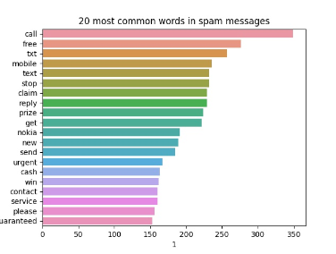
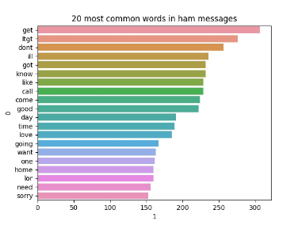

# Text-Classification-using-LSTM-and-BiLSTM-with-data-augmentation
Spam and Ham messages classification by using LSTM and BiLSTM models. Analysed the performance of the models with data augmentation. 

## Summary

Worked on text classification using SMS dataset containing spam and ham messages. Implemented LSTM and BiLSTM models and analyzed their performances on original data and augmented data. Following things are completed for this project.

1) Performed data cleaning
2) Performed data augmentation to balance the dataset
3) Analyzed data by extracting most common words for spam and ham messages
4) Implemented LSTM model to classify spam and ham messages
5) Implemented BiLSTM model to classify spam and ham messages
6) Implemented callbacks for LSTM and BiLSTM models
7) Used K-Fold cross validation technique
8) Analyzed the performance of LSTM and BiLSTM models on original and augmented dataset by using metrics such as accuracy, f1 score, and roc auc score.

## Dataset Description

The dataset used for the project contains text messages (SMS) which includes spam and ham messages. 

Link to the dataset: https://www.kaggle.com/datasets/uciml/sms-spam-collection-dataset

### Number of samples
Total number of samples are 5572

### Number of Features
Total number of features are 5

### Features Description
The two main features in the dataset are named as v1 and v2. Other three features are unnamed columns.

**v1:** This column contains labels for the text messages. These labels include spam and ham.

**v2:** This column contains text messages.

**Unnamed: 2:** There is no name provided for this column. This column contains only 50 values which are just random text. As this column is not useful, it is discarded. 

**Unnamed: 3:** This is another unnamed column containing only 12 values which are not useful. This column is discarded as well.

**Unnamed: 4:** This column contains only 6 values. As it is not useful, it is discarded as well.

### Group of Interest
The group of interest is spam text messages.

### Group Not of Interest
The group not of interest is ham text messages.

### Sample Counts for Group of Interest
There are 747 samples for group of interest

### Sample Counts for Group Not of Interest
There are 4825 samples for group not of interest

## Details

The details for each point in the summary is provided below.

1) The textual data contains some unwanted information and words which can not be useful for the model to classify the text message. In some cases, this useless information can mislead the model and it can perform wrong classification. To remove the useless information I cleaned the text messages. For this purpose, I implemented methods to remove stop words, punctuation, and digits from the text messages. I also filtered the words having length less than 3 such as "ok", "u", "im". As these words are not useful for classification, I removed these words as well from the text messages. 

2) As the dataset is highly imbalanced (747 samples for spam and 4825 samples for ham), I used data augmentation technique to generate new samples for the spam messages. For this purpose, I used `EmbeddingAugmenter` method from `textattack` library. For each spam sample, 6 new samples are generated. After performing the augmentation, the sample count for spam messages increase to 5216 which is very close to the ham messages. The total count of the samples becomes 10041 after adding augmented data to the original dataset.

3) After performing data cleaning and removing useless words, I extracted the most common words for both spam and ham messages. Based on these words, I can relate the dataset with the performance of the models. The plots provided below show the 20 most common words for spam and ham messages. From the plots, we can see that there is a good difference of words for both types of messages. Spam messages contain words like "free", "claim", "prize", "cash", "win" while ham messages have words which are generally used in text messages. So, based on these words it is not hard for the models to differentiate between spam and ham messages. 
 

4) I implemented an LSTM model to classify spam and ham messages. It is a sequential model containing an embedding layer, three LSTM layers, and two dense layers. The dropout layers are also used in the architecture as a regularization technique.

5) A BiLSTM model is also implemented based on the architecture of LSTM model. The architecture of this model is similar to the LSTM model but different parameters are used based on my understanding of BiLSTM models.

6) I also implemented two callbacks for both the models using `EarlyStopping` method. One callback monitors the validation loss. If the validation loss does not decrease for two epochs, then the callback is activated. The minimum change for this callback is 0.0001. The second callback monitors the validation accuracy. If the validation accuracy does not increase for three epochs then this callback is activated. The minimum change for this callback is 0.001.

7) To validate the performance of the models, I used `StratifiedKFold` technique. The models are trained and tested on five different folds.

8) I analyzed the performance of LSTM and BiLSTM models on the original dataset and the dataset combined with augmented data. The metrics used to test the models include accuracy, F1 score, and ROC AUC score. The values for these metrics are provided below.

The below table contains F1 scores for LSTM and BiLSTM models on the original dataset and the dataset with augmented samples.

| classifier |   fold1 |   fold2 |   fold3 |   fold4 |   fold5 |   mean |
|:-----------|--------:|--------:|--------:|--------:|--------:|-------:|
| LSTM       |   0.9315  |   0.9215  |   0.9230 |   0.9172 |   0.9251 |  0.9236 |
| LSTM (With Aug)       |   0.9900  |   0.9846  |   0.9928 |   0.9293 |   0.9801 |  0.9753 |
| BiLSTM     |   0.9423 |   0.9065 |   0.9115 |   0.9109 |   0.9225 |  0.9188 |
| BiLSTM (With Aug)     |   0.9933 |   0.9927 |   0.9932 |   0.9218 |   0.9688 |  0.9740 |

The below table contains Accuracy scores for LSTM and BiLSTM models on the original dataset and the dataset with augmented samples.

| classifier |   fold1 |   fold2 |   fold3 |   fold4 |   fold5 |   mean |
|:-----------|--------:|--------:|--------:|--------:|--------:|-------:|
| LSTM       |   0.9820  |   0.9793  |   0.9802 |   0.9784 |   0.9802 |  0.9800 |
| LSTM (With Aug)       |   0.9895  |   0.9840  |   0.9925 |   0.9312 |   0.9795 |  0.9753 |
| BiLSTM     |   0.9847 |   0.9757 |   0.9766 |   0.9766 |   0.9802 |  0.9788 |
| BiLSTM (With Aug)     |   0.9930 |   0.9925 |   0.9930 |   0.9243 |   0.9681 |  0.9742 |

The below table contains ROC AUC scores for LSTM and BiLSTM models on the original dataset and the dataset with augmented samples.

| classifier |   fold1 |   fold2 |   fold3 |   fold4 |   fold5 |   mean |
|:-----------|--------:|--------:|--------:|--------:|--------:|-------:|
| LSTM       |   0.9716  |   0.9643  |   0.9730 |   0.9634 |   0.9622 |  0.9669 |
| LSTM (With Aug)       |   0.9900  |   0.9840  |   0.9925 |   0.9368 |   0.9794 |  0.9765 |
| BiLSTM     |   0.9736 |   0.9614 |   0.9543 |   0.9567 |   0.9759 |  0.9644 |
| BiLSTM (With Aug)     |   0.9933 |   0.9924 |   0.9930 |   0.9306 |   0.9680 |  0.9754 |

From the above tables, we can see that both LSTM and BiLSTM models have similar performances which can be due to the similar architectures of both the models. For some folds LSTM is performing better while for other folds BiLSTM is performing better but the difference is really small. The good performance of both the models can be due to the difference in common words for spam and ham messages. As shown above, the common words for spam and ham messages are easily differentiable so it is not hard for the models to classify the text messages based on these words.

If we analyze the performance of the models on the original dataset, we can see that the accuracy and ROC AUC metrics are misleading due to the imbalanced dataset. For imbalanced data, F1 score can be the only reliable metric as it considers precision and recall. That is why we see a big difference in F1 score and other two metrics on the original dataset.  

Furthermore, based on the F1 score, we can see a good improvement in the performance of the models after adding the augmented samples to the dataset. An interesting thing to note is that all the three metrics have very similar scores when balanced data is used. Hence a balanced distribution of both the classes by using augmentation technique significantly improves the classification performed by the models.

